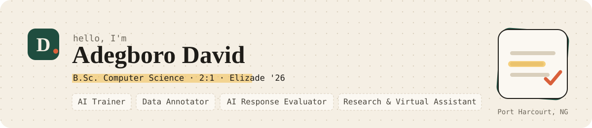

Hi, I'm Dave. I'm a Computer Science graduate from Elizade University (Second Class Upper, class of 2026), based in Port Harcourt, Nigeria.

I did six months of corporate ICT support (SIWES) with Jevi Austin International Company Ltd at the Oando project site. It taught me to follow procedures to the letter, keep accurate records, and explain technical things in plain language. Those same habits are what AI training and evaluation work needs, and that's where I'm focusing now. I also build small, practical software, mostly in Python, JavaScript, Java, and Kotlin.

**Open to:** AI training, data annotation, AI response evaluation, research / virtual assistant roles, and junior developer roles (remote, freelance, contract, or full-time).

## Things you can try right now

| Project | What it is | Try it |
|---|---|---|
| [Kobo · Expense Tracker](https://github.com/Dave-4u/expense-tracker) | Naira budget tracker that tells you, in plain words, how much you can still spend per day | [live](https://dave-4u.github.io/projects/expense-tracker/) |
| [ShopFront](https://github.com/Dave-4u/shopfront) | Storefront demo: search, bag, and a checkout that helps instead of shouts | [live](https://dave-4u.github.io/projects/shopfront/) |
| [Bank / Kolo](https://github.com/Dave-4u/bank) | Python console bank with hashed passwords and tests, plus a mobile-style web twin | [live](https://dave-4u.github.io/bank/) |
| [Grain](https://github.com/Dave-4u/grain-humanizer) | Rewrites stiff, AI-sounding text so it reads more naturally | see repo |
| [AI Movie Generator](https://github.com/Dave-4u/ai-movie-generator) | Story → script → shots → clips, using free models | see repo |
| [YT Shorts Autoposter](https://github.com/Dave-4u/yt-shorts-autoposter) | Turns long videos you own into captioned Shorts | see repo |
| [X Follow Tracker](https://github.com/Dave-4u/x-follow-tracker) | Local tool for non-follow-backs and unfollow alerts | see repo |

## Small games (each has a browser version)

| Game | Language | Play |
|---|---|---|
| [Number guessing](https://github.com/Dave-4u/python-number-guessing) | Python | [Hot or Cold](https://dave-4u.github.io/python-number-guessing/) |
| [Number guessing](https://github.com/Dave-4u/java-number-guessing) | Java | [Hot or Cold](https://dave-4u.github.io/java-number-guessing/) |
| [Rock paper scissors](https://github.com/Dave-4u/csharp-rock-paper-scissors) | C# | [Chalkboard RPS](https://dave-4u.github.io/csharp-rock-paper-scissors/) |

## Get in touch

- Portfolio: [dave-4u.github.io](https://dave-4u.github.io/)
- Email: adegborodamilaredavid@gmail.com
- Phone: +234 810 159 7428
- LinkedIn: [adegboro-david](https://www.linkedin.com/in/adegboro-david-76a06a430/)
